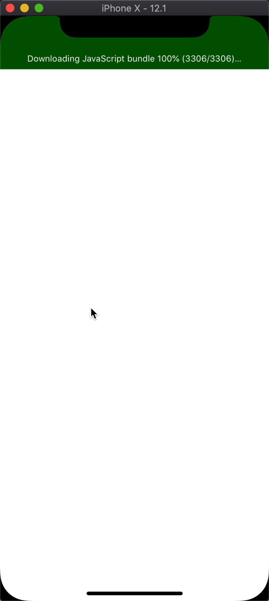

#React Native and Redux

This application was a tutorial to work with react native and redux. The app takes some dummy JSON objects displaying different library names such as "Webpack", "React", etc and displays them in a list view. Then as the user taps through the different names, an action creater to update the selectedId in the redux store which then triggers a displayed textbox with info about that library

Things learned:

- Though I had already learned how to work with redux, I learned how to incorporate it into a React Native project.
- Listviews in React Native and how they work under the hood
- Animation basics in React Native with _LayoutAnimation_ along with _Touchables_ for user interaction

